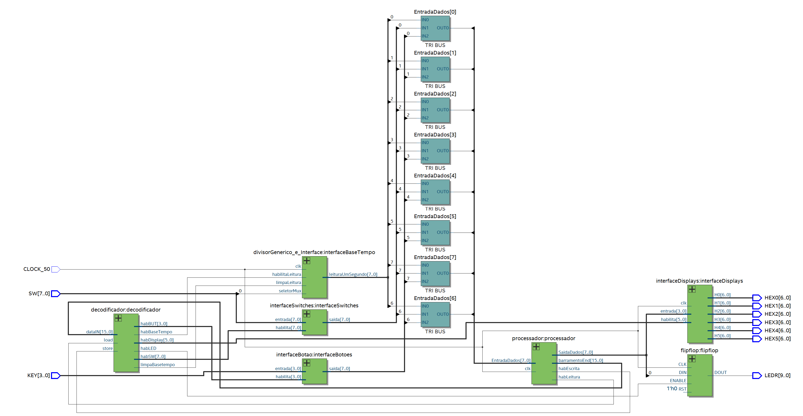

# Projeto 1: Relógio Utilizando um Processador Personalizado

### Hardware:
 
- `FPGA DE0-CV` 

### Manual explicativo:
- **SWITCHES**:
    - **SW 0** → Seletor da Base de Tempo;
    - **SW 3** → Interrupção/Retorno da contagem do relógio e liberação/interrupção do uso dos Botões
- **BOTÕES (somente quando SW3 estiver ligada)**:
    - **KEY0** → Incremento dos Minutos;
    - **KEY1** → Incremento das Horas;

### Fluxo de Dados:

### Rubrica:

- **C**
    - [X] Indica horas, minutos e segundos:
        - [X] O horário deverá ser mostradp através do display de sete segmentos
    - [X] Possui algum sistema para acertar o horário
    - [X] Possui seleção da base de tempo
    
- **Extras**

    - [x] Indicação do horário com base em 12 horas -AM/PM
    - [ ] Sistema de despertador
    - [ ] Temporizador com contagem regressiva
    - [x] Montador (assembler) para o processador criado:
        - [x] Deve ser em Python
    - [ ] Pilha controlada por hardware (instruções push e pop no processador):
        - [ ] Pode ter a posição fixa na memória (não precisa iniciar o ponteiro da pilha).
    - [ ] Instrução de chamada de sub-rotina com um nível:
        - [ ] Não precisa atender chamadas aninhadas, ou seja, sem recursão;
        - [ ] O endereço de retorno, pode ser armazenado na pilha ou em registrador específico.
        - [ ] O destino pode ter como referência o PC ou ser absoluto.
